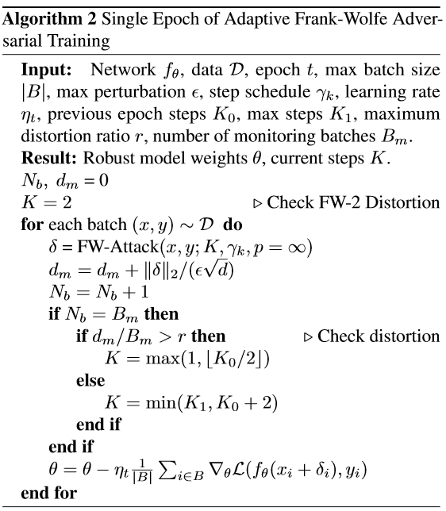
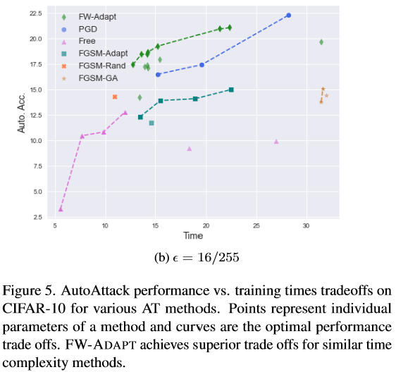

# Understanding and Increasing Efficiency of Frank-Wolfe Adversarial Training

Preprint: https://arxiv.org/abs/2012.12368

## Overview and Key Ideas

This is the source code used to run experiments in the paper: 
_Understanding and Increasing Efficiency of Frank-Wolfe Adversarial Training_ .

The goal is to speed up adversarial training (AT) without sacrificing robustness via a solid mathematical theory. By using the more mathematically transparent Frank-Wolfe (FW) optimization in place of the more popular Projected Gradient Decent (PGD) we are able to derive a relationship between the loss landscape and the L2 norm of L-infinity FW attacks (distortion).  We show the following properties

- _High distortion high step attacks are inefficient_
- _Low distortion signals existence of strong high step attacks that are likely to be successful_

In particular we show that this distortion is a strong signal for catastrophic overfitting (CO) in single step adversarial training methods even for the relatively weak FW-2 attacks. By monitoring the distortion of a FW-2 attack during the beginning of a training epoch we are able to adaptively change the number of attack steps **all while simultaneously performing AT**. FW-Adapt can train faster than strong multi-step AT methods, such as PGD-7, while avoiding CO of fast single step methods.

## FW-Adapt Algorithm


## Performance Comparisons


## Running Experiments

### Requirements

In order to have consistent libraries and versions, you may create a conda environment via:

```sh
conda env create -f environment.yml
```

then activate with
```sh
conda activate fwadapt
```

### Training Standard Models
We provide the model weights `cifar10_resnet18_baseline_nat_acc_94.pt` [download here](https://www.dropbox.com/s/i1pvh6qc2vltg6q/cifar10_resnet18_baseline_nat_acc_94.pt?dl=0) and so any experiments on cifar10 can be run with the `--pretrained` flag in order to intialize with these weights as was done in the paper. In order to train a standard model on cifar100 run:

```
python train.py --mode=standard --dataset=cifar100 --data_path=./data --num_epochs=160 --ep_decay=60
```

### Training FW-Adapt

We provide ready-to-run code for our FW-Adapt model and the following fast AT baselines: PGD, FGSM-Adapt, FGSM-GA, Free, FW. See details in our paper. Use the following:

```sh
python train.py --mode=fw_adapt --min_dr=r \
    --data_path=./data \
    --lr=0.1 \
    --num_epochs=30 \
    --ep_decay=15
    --pretrained
```

To run FW-Adapt-AT with L-infinity norm `8/255` at distortion ratio `r` on CIFAR-10 with data located in `./data`, for `30` epochs with an initial SGD learning rate of `0.1` that decays by 0.1 every `15` epochs. The `--pretrained` flag assumes you have a pretrained model named:

```yaml
cifar10:  cifar10_resnet18_baseline_nat_acc_94.pt
cifar100: <see `Training Standard Models`>
```

this flag may be removed and the model will train from scratch.

Details about the various modes and flags and AT modes can be found in `AdversarialTrainer.AdversarialTrainer.__init__`. 

Results are saved in:
```
|-topdir/
    |-exp_tag/
        |-checkpoints/
            |-<model checkpoints>.pt
        |-hparams.yaml (params used in trainer)
        |-train_results.csv
        |-eval_results.csv 
```

### Training Other Baselines
We provide some basic examples of training other AT methods at epsilon=8/255. For more details please see `AdversarialTrainer.AdversarialTrainer.__init__`. All methods have the flags

```
    --data_path=./data \
    --lr=0.1 \
    --num_epochs=30 \
    --ep_decay=15 \
    --pretrained
```

passed after them as was done in FW-Adapt above.

**PGD** with 7 steps
```
python train.py --mode=pgd --K=7 \
```

**FGSM-Adapt** with 4 checkpoints
```
python train.py --mode=fgsm_adapt --K=4 \
```

**FGSM-GA** with regularizer 0.5
```
python train.py --mode=grad_align --grad_align_lambda=0.5 \
```

**Free** with 8 minibatch replays
```
python train.py --mode=free --K=8
```

**FW** with 7 steps
```
python train.py --mode=fw --K=7
```


### AutoAttack and PGD-50 Evaluation

Install autoattack into your `fwadapt` environment.
```
pip install git+https://github.com/fra31/auto-attack
```

After training the model you can evaluate with AutoAttack and PGD-50 via

```
python autoattack.py --exp_dir=topdir/exp_tag/ --data_path=./data
```

Note these attacks are performed using the epsilon value chosen in `hparams.yaml`. The results will be in
```
|-topdir/
    |-exp_tag/
        |-autoattack_and_pgd50_value.yaml
```

## License

The code for FW-Adapt is licensed under the MIT License.


## Acknowledgement

Research was sponsored by the United States Air Force Research Laboratory and the United States Air Force Artificial Intelligence Accelerator and was accomplished under Cooperative Agreement Number FA8750-19-2-1000. The views and conclusions contained in this document are those of the authors and should not be interpreted as representing the official policies, either expressed or implied, of the United States Air Force or the U.S. Government. The U.S. Government is authorized to reproduce and distribute reprints for Government purposes notwithstanding any copyright notation herein.
